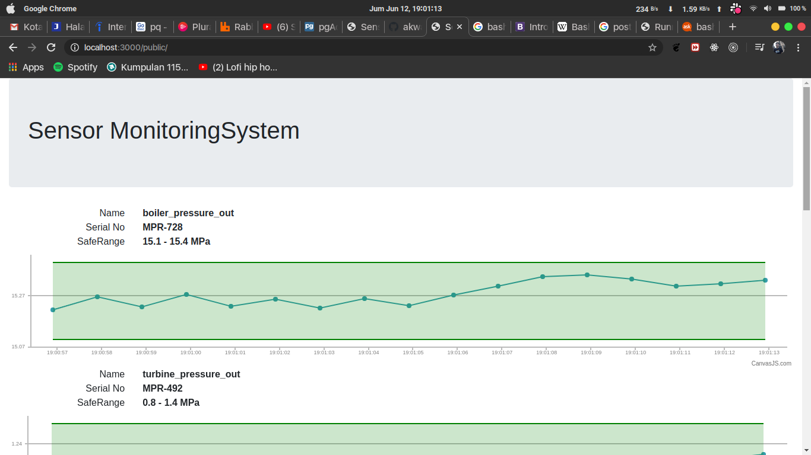

# Steam Power Plant Monitor Application

This is simple distributed system with go
Build with go, rabbitMQ, and postgres

## How to run

- Linux

```bash
    chmod +x ./run.sh
    ./run.sh
```

## Preview



## Author

AkwanMaroso
